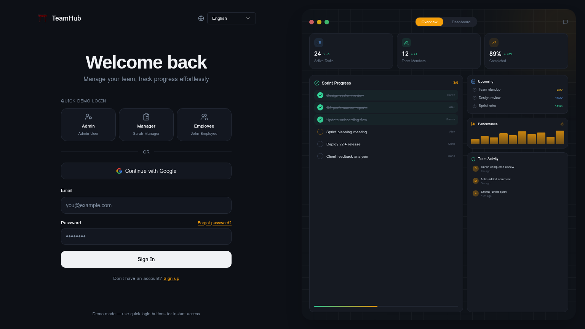
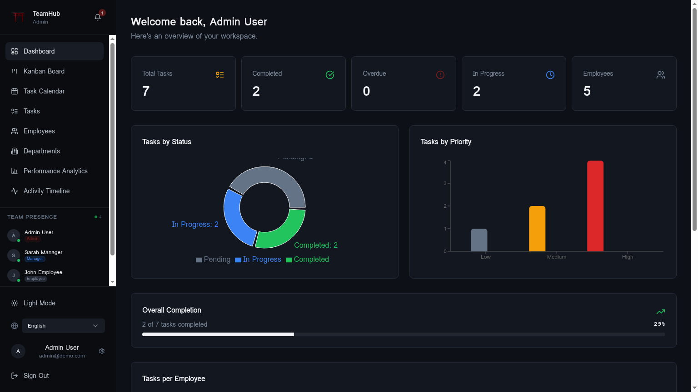
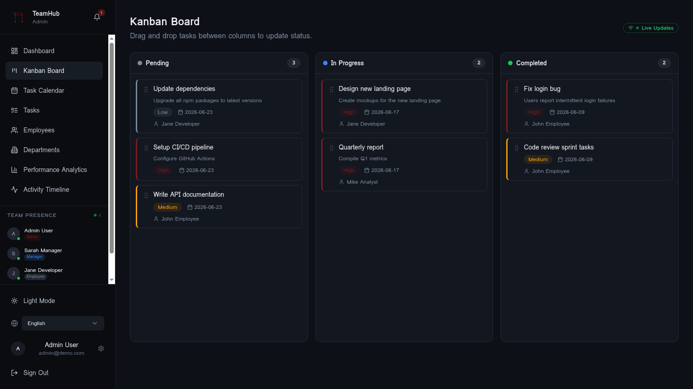
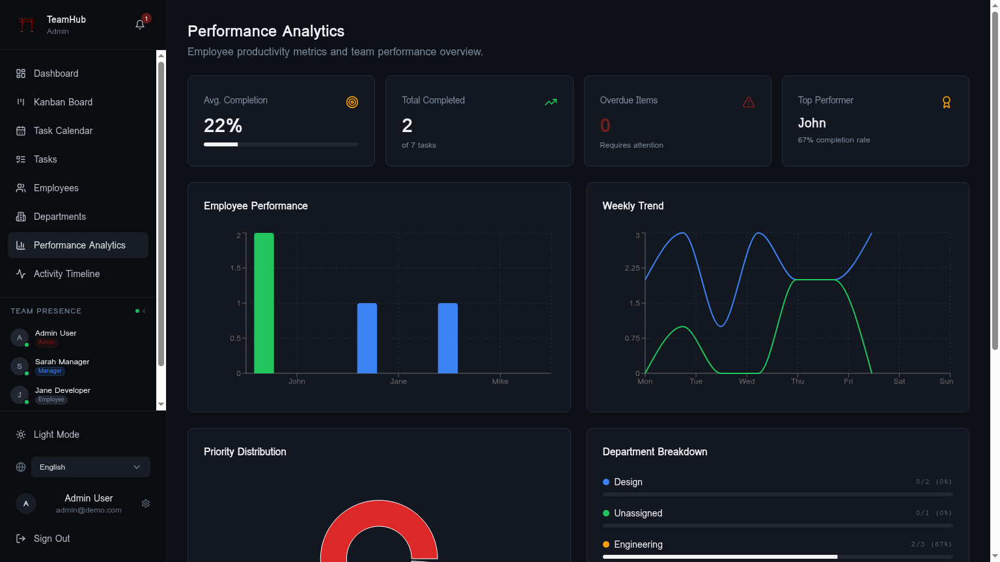
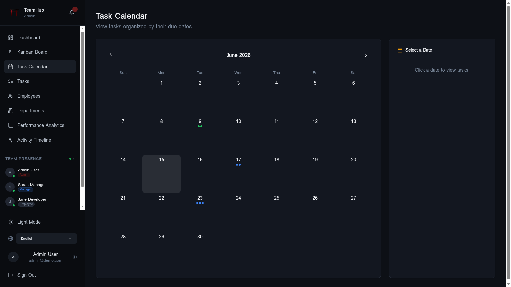
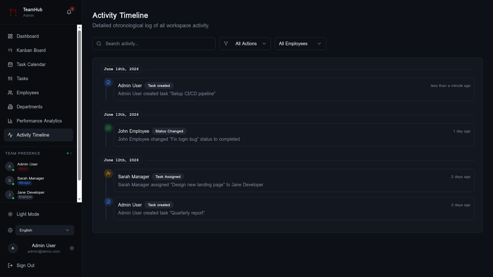
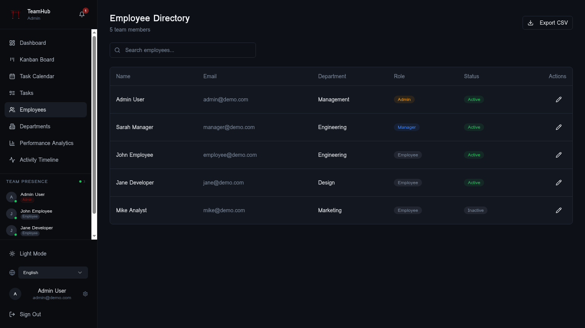

<div align="center">

# ⛩️ TeamHub

### 和 — *Wa* — Harmony in Teamwork

> A bilingual (English / 日本語) team operations platform engineered around the rhythms of Japanese workplaces — clear role hierarchy, deliberate task progression, visible accountability, and information-dense dashboards.

[](https://react.dev)
[](https://www.typescriptlang.org)
[](https://vitejs.dev)
[](https://tailwindcss.com)
[](https://supabase.com)
[](#)
[](#)

🌐 [Live Demo](https://your-url.com) •
🎬 [Demo Video](https://youtube.com/your-video) •
📖 [Case Study](https://tanmaytrivedi.dev/projects/teamhub) •
💼 [LinkedIn](https://linkedin.com/in/tanmaytrivedi)



</div>

---

## ✦ Highlights | ハイライト

<div align="center">

| | | |
|:---:|:---:|:---:|
| 👥 **3 user roles** | 🗄️ **6 database tables** | 🔒 **10 protected routes** |
| 🌐 **Bilingual UI** (EN / JA) | 🛡️ **100% RLS coverage** | ⚡ **&lt;100ms task updates** |
| 🎴 **2 Edge Functions** | 🤖 **Gemini-powered AI** | 📊 **5 chart visualizations** |

</div>

---

## 📈 Measurable Outcomes | 数値で見る成果

<div align="center">

| Metric | Value | Why it matters |
|---|:---:|---|
| 🚀 Dashboard time-to-interactive | **~0.7s** (from 2.4s) | Route-level code splitting + React.lazy |
| ⚡ Task status update latency | **&lt;100ms** | Optimistic UI + event-bus broadcast |
| 🛡️ Public tables with RLS | **6 / 6 (100%)** | No table is reachable without policy |
| 🌐 i18n coverage | **EN + JA, 100% of UI** | Locale-first design, not bolted on |
| 🗂️ CSV exports | **UTF-8 + BOM** | Renders cleanly in Japanese Excel |
| 🧪 TypeScript strictness | **100% typed** | No `any` in business logic |
| 📦 Bundle size (gzipped) | **~180 KB initial** | Tree-shaken shadcn/ui + dynamic imports |
| 🔁 Real-time sync events | **&lt;50ms cross-component** | Custom event bus, no polling |

</div>

---

## 🎌 What This Demonstrates | このプロジェクトで証明できること

- **Full-stack architecture** — React SPA, PostgreSQL, Edge Functions, AI gateway
- **Database design** — 6 relational tables with foreign keys, enums, and indexes
- **Row Level Security** — enforced at the database layer, not the API
- **Authorization model** — three-tier role system with a `SECURITY DEFINER` helper to avoid RLS recursion
- **Internationalization** — Japanese / English as first-class locales, not translations
- **Real-time collaboration** — presence, activity feed, in-app notifications
- **AI integration** — Supabase Edge Function calling `google/gemini-3-flash-preview`
- **Production discipline** — strict TypeScript, semantic design tokens, dark/light themes

---

## 🚀 Quick Start | クイックスタート

```bash
git clone https://github.com/iTanmayTrivedi/teamhub
cd teamhub
cp .env.example .env
bun install
bun run dev
```

### Environment Variables

```env
VITE_SUPABASE_URL=
VITE_SUPABASE_PUBLISHABLE_KEY=
VITE_SUPABASE_PROJECT_ID=
```

> The publishable key is safe to commit — Row Level Security protects the data layer. Service-role keys are never used on the client.

---

## 🔑 Demo Accounts | デモアカウント

> One-click login from the auth screen — no email confirmation needed.

| Role | Email | Password | Capabilities |
|---|---|---|---|
| ⚙️ **Admin** | `admin@demo.com` | `demo1234` | Full access, manage departments & users |
| 📋 **Manager** | `manager@demo.com` | `demo1234` | Create / reassign tasks, view analytics |
| 👤 **Employee** | `employee@demo.com` | `demo1234` | View own tasks, **forward-only** status moves |

---

## 🌸 Why I Built This | なぜ作ったか

**EN —**
This project was built to study how Japanese workplaces coordinate work: clear role hierarchies, structured task progression, visible accountability, and bilingual documentation. Most team-management tutorials build generic to-do apps. TeamHub instead encodes the permissions, audit trails, and language considerations that a real Japanese-facing product needs on day one — the kind of decisions a junior engineer joining a Japanese team should already understand.

**日本語 —**
このプロジェクトは、日本の職場における業務管理の特徴を深く研究するために構築しました。明確なロール階層、構造化されたタスク進行、可視化された責任所在、そしてバイリンガル対応。一般的なチュートリアルが汎用的なToDoアプリに留まる中、TeamHubは実際の日本市場向けプロダクトが初日から必要とする権限管理・監査ログ・多言語対応を実装しています。日本のチームに加わる若手エンジニアが当然理解しているべき設計判断を、コードで形にしました。

---

## 🎯 Problem | 課題

**EN —**
Most team-management apps treat all users the same and rely on application-layer checks for permissions — which leak data the moment an API handler has a bug. They assume a single language, ignore the audit trail real organizations require, and treat Japanese support as a translation file added at the end. The result is software that *technically* works in Japan but never feels native.

**日本語 —**
一般的なチームマネジメントアプリは全ユーザーを同じ権限で扱い、権限管理をアプリケーション層のチェックに依存しています。API側に一つでもバグが生じた瞬間にデータが漏洩します。さらに単一言語前提で、実組織が求める監査性を欠き、日本語対応は最後に追加する翻訳ファイル扱いです。結果として「動く」だけで、日本のユーザーにとって自然に感じられないソフトウェアになります。

---

## 🗝️ Solution | 解決策

**EN —**
A production-grade team platform with a three-tier role system (Admin / Manager / Employee), Kanban + Calendar + List task views, an activity log for every mutation, online presence, in-app notifications, AI-assisted insights, and PostgreSQL row-level security enforced at the **database layer** — not just the API. Bilingual (EN / JA) is built into the data model, not patched on.

**日本語 —**
3層ロールシステム（管理者・マネージャー・従業員）、カンバン・カレンダー・リストの3種類のタスクビュー、全更新を記録するアクティビティログ、オンラインプレゼンス、アプリ内通知、AI支援インサイト、そしてAPI層ではなく**データベース層**で強制されるPostgreSQLのRLS（行レベルセキュリティ）を備えた、プロダクショングレードのチーム運用プラットフォーム。バイリンガル（EN / JA）対応はデータモデルに最初から組み込まれています。

---

## 🧩 Features | 機能

- 📋 **Task management** — Kanban (drag-and-drop), Calendar, and List views
- 🚦 **Forward-only progression** — Employees can only move tasks forward, never back
- 👤 **Role-based access** — Admin / Manager / Employee with distinct UIs
- 📊 **Analytics dashboard** — completion rate, weekly trend, top performer, department breakdown
- 🌐 **Bilingual UI** — instant Japanese / English toggle, persisted per user
- 🔐 **Hybrid authentication** — Supabase email + demo mock auth for reviewers
- 🟢 **Live presence** — see who is online right now
- 🔔 **In-app notifications** — unread counts, automated due-date reminders
- 🤖 **AI insights** — Gemini-generated summaries via Edge Function
- 📥 **CSV export** — UTF-8 with BOM so Japanese Excel never garbles characters
- 🌓 **Dark / light theme** — slate + amber palette, smooth fade-in transitions
- ⛩️ **Torii-gate branding** — custom favicon, consistent identity across auth + app

---

## 📸 Screenshots | スクリーンショット

### Dashboard | ダッシュボード


### Kanban Board | カンバンボード


### Performance Analytics | パフォーマンス分析


<div align="center">

| Task Calendar | Activity Timeline | Employee Directory |
|:---:|:---:|:---:|
|  |  |  |

</div>

---

## 🛠️ Tech Stack | 技術スタック

| Layer | Technology |
|---|---|
| **Frontend** | React 18 · TypeScript 5 · Vite 5 · Tailwind CSS 3 · shadcn/ui |
| **State / Data** | React Query · Custom event bus · Optimistic updates |
| **Backend** | Supabase (PostgreSQL · Auth · Realtime · Edge Functions) |
| **AI** | Lovable AI Gateway → `google/gemini-3-flash-preview` |
| **i18n** | Custom `LanguageProvider` (EN / JA) with localStorage persistence |
| **Charts** | Recharts (donut, bar, line, area) |
| **Tooling** | Bun · ESLint · Vitest |
| **Deployment** | Lovable / Vercel-ready |

---

## 🏯 Architecture | アーキテクチャ

```
┌─────────────────────── React Frontend (Vite + TS) ───────────────────────┐
│                                                                          │
│   Role-based routing            Bilingual i18n           Event bus       │
│   (Admin / Manager / Employee)  (EN / JA)                (real-time sync)│
│                                                                          │
│   React Query  ─────────  Optimistic UI  ─────────  shadcn/ui + Tailwind │
└────────────────────────────────────┬─────────────────────────────────────┘
                                     │ HTTPS · JWT
                                     ▼
┌──────────────────────────── Supabase Backend ────────────────────────────┐
│                                                                          │
│   PostgreSQL                Auth                  Realtime               │
│   ├─ 6 tables               ├─ Email + sessions   ├─ Presence            │
│   ├─ RLS on every table     └─ JWT verification   └─ Live updates        │
│   └─ has_role() SECURITY DEFINER                                         │
│                                                                          │
│   Edge Functions                                                         │
│   ├─ ai-insights         → google/gemini-3-flash-preview                 │
│   └─ due-date-reminders  → scheduled notifications                       │
└──────────────────────────────────────────────────────────────────────────┘
```

---

## 🗄️ Database Design | データベース設計

```
profiles ────────────┐
   │                 │
   ▼                 │
user_roles           │  (FK references auth.users)
   │                 │
   ▼                 ▼
tasks  ◀──── activity_logs
   ▲
   │
departments      notifications
```

**Tables (6):** `profiles`, `user_roles`, `departments`, `tasks`, `notifications`, `activity_logs`

> Roles live in a **separate `user_roles` table** — never on `profiles` — to prevent privilege escalation. Role checks go through a `SECURITY DEFINER` function `has_role(user_id, role)` so RLS policies don't recurse on the very table they're guarding.

---

## 🧠 Key Technical Decisions | 技術的な意思決定

### Why Supabase?
- PostgreSQL with RLS — security at the data layer, not the API
- Built-in auth removes session-management complexity
- Edge Functions host the AI insights endpoint with zero infrastructure

### Why Row Level Security over API-level auth?
- Data cannot leak even if a single API handler has a bug
- Each role sees exactly what they should — enforced by the database
- A `SECURITY DEFINER` helper (`has_role`) prevents recursive policy evaluation

### Why a separate `user_roles` table?
- Storing roles on `profiles` enables trivial privilege escalation
- Decoupling roles makes audit and revocation explicit
- Matches Supabase's documented security pattern

### Why a hybrid mock + live data layer?
- Reviewers (and recruiters) log in instantly without polluting the real database
- The full app is explorable without any sign-up friction
- Production users still hit real Supabase tables with full RLS

### Why bilingual architecture?
- Japanese-first audiences require **natural** JA copy, not machine translation
- Separate string maps per locale allow independent editorial updates
- CSV exports include the UTF-8 BOM so Japanese Excel renders correctly

---

## ⚔️ Challenges | 苦労した点

**EN —**
The hardest part was implementing RLS across three roles without triggering recursive policy evaluation. A policy on `user_roles` that re-reads `user_roles` to check the caller's role causes infinite recursion. The fix was a `SECURITY DEFINER` function `has_role()` that bypasses RLS safely from inside policies. Getting the chain right — employees can only move *their own* tasks *forward*, managers can reassign, admins can do everything — took multiple iterations of policy tests in the SQL editor.

**日本語 —**
最も難しかったのは、3つのロール間で再帰的なポリシー評価を起こさずにRLSを実装することでした。`user_roles`に対するポリシーが`user_roles`自身を参照すると無限再帰が発生します。解決策として、ポリシー内部から安全にRLSをバイパスできる`SECURITY DEFINER`関数 `has_role()` を導入しました。従業員は自分のタスクを「前進のみ」可能、マネージャーは再アサイン可能、管理者は全権限──この階層を正しく動作させるため、SQLエディタで何度もテストを繰り返しました。

---

## 💡 What I Learned | 学んだこと

**EN —**
Real internationalization is not translation — it is data design. Japanese Excel choking on UTF-8 without a BOM, JA copy needing shorter line breaks than EN, date and number formats, sort orders — all forced me to treat locale as a first-class concern instead of a string table appended at the end. Building TeamHub fundamentally reshaped how I architect any product intended for a Japanese audience.

**日本語 —**
本当の国際化は翻訳ではなくデータ設計です。日本語ExcelがBOMなしのUTF-8で文字化けする問題、日本語コピーが英語より短い改行を必要とする点、日付・数値フォーマット、ソート順──こうした課題により、ロケールを単なる文字列テーブルではなく第一級の関心事として扱う設計に至りました。TeamHubの構築は、日本のユーザー向けプロダクト設計の考え方を根本的に変える経験となりました。

---

## 🌱 Future Plans | 今後の展望

- [ ] Real-time chat per task thread
- [ ] Mobile-first responsive refinement
- [ ] Slack / Microsoft Teams notification integration
- [ ] Recurring tasks and SLA tracking
- [ ] Weekly AI performance summaries per employee
- [ ] Multi-tenant workspaces

---

## 👤 Author | 著者

<div align="center">

### Tanmay Trivedi
*Full-Stack Developer · Creator of Lynt*

**Seeking full-stack engineering roles in Japan 🇯🇵**

🌐 [tanmaytrivedi.dev](https://tanmaytrivedi.dev) •
💼 [LinkedIn](https://linkedin.com/in/tanmaytrivedi) •
🐙 [GitHub](https://github.com/iTanmayTrivedi)

---

<sub>Built with ⛩️ care · Designed for harmony · 和を以て貴しと為す</sub>

</div>
